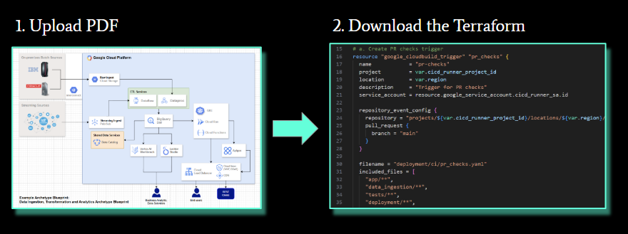

# TF-Generator

Turn your architecture diagrams into executable Terraform!

## Context

This solution was created as part of the **Google Cloud Agentic Era Hackathon**. This repo represents a few hours work by architects from EPAM over the course of the day.

## Created Using the Agent-Starter-Pack

This solution has been built using the base 'ReAct agent using LangGraph' from the [`googleCloudPlatform/agent-starter-pack`](https://github.com/GoogleCloudPlatform/agent-starter-pack).

## What Problem Are We Solving?

Consider this common scenario:

- The architect comes up with a beautiful diagram.
- An engineer then implements in Terraform. BUT…
  - The process to convert to TF can take a long time.
  - The resulting TF doesn’t necessarily match the diagram.
   - The resulting TF may not follow your organisation’s standards and policies.

## What Is Our Solution?

Our Agent takes an uploaded architecture image (e.g. PDF or PNG) and uses Gemini to convert the image to Terraform IaC.



## Design Decisions

- LLM: Gemini 2.0 will be used, given its multimodal capabilities. We can combine a text prompt with uploaded images, and render code output.
- Agent Runtime: Vertex AI Agent Engine - a fully-managed, serverless PAYG service for deploying and scaling AI agents. We can leverage the agent-starter-pack to build our agent from template code, and then deploy to Agent Engine.
- Frontend: Cloud Run, hosting Streamlit.
- We start from the langgraph_base_react template, meaning that we only need to replace our agent.
- The solution requires no database; files are uploaded by the user, and state is only persisted at session level.

## Project Structure

This project is organized as follows:

```
iac-auto-generator/
├── app/                 # Core application code
│   ├── agent.py         # Main agent logic
│   ├── agent_engine_app.py # Agent Engine application logic
│   └── utils/           # Utility functions and helpers
├── deployment/          # Infrastructure and deployment scripts
├── env-setup/           # Guidance for local dev environment setup
├── frontend/            # Containerised Streamlit frontend
├── notebooks/           # Jupyter notebooks for prototyping and evaluation
├── tests/               # Unit, integration, and load tests
├── Makefile             # Makefile for common commands
└── pyproject.toml       # Project dependencies and configuration
```

## Requirements

Before you begin, ensure you have:
- **uv**: Python package manager - [Install](https://docs.astral.sh/uv/getting-started/installation/)
- **Google Cloud SDK**: For GCP services - [Install](https://cloud.google.com/sdk/docs/install)
- **Terraform**: For infrastructure deployment - [Install](https://developer.hashicorp.com/terraform/downloads)
- **make**: Build automation tool - [Install](https://www.gnu.org/software/make/) (pre-installed on most Unix-based systems)

### Installation

Install required packages using uv:

```bash
make install
```

## Dev Environment Setup

See [env-setup/README.md](env-setup/README.md).

## Frontend Deployment

See [frontend/README.md](frontend/README.md).

## Commands

| Command              | Description                                                                                 |
| -------------------- | ------------------------------------------------------------------------------------------- |
| `make install`       | Install all required dependencies using uv                                                  |
| `make playground`    | Launch Streamlit interface for testing agent locally and remotely |
| `make backend`       | Deploy agent to Agent Engine service |
| `make test`          | Run unit and integration tests                                                              |
| `make lint`          | Run code quality checks (codespell, ruff, mypy)                                             |
| `uv run jupyter lab` | Launch Jupyter notebook                                                                     |

For full command options and usage, refer to the [Makefile](Makefile).


## Usage

1. **Prototype:** Build your Generative AI Agent using the intro notebooks in `notebooks/` for guidance. Use Vertex AI Evaluation to assess performance.
2. **Integrate:** Import your chain into the app by editing `app/agent.py`.
3. **Test:** Explore your chain's functionality using the Streamlit playground with `make playground`. The playground offers features like chat history, user feedback, and various input types, and automatically reloads your agent on code changes.
4. **Deploy:** Configure and trigger the CI/CD pipelines, editing tests if needed. See the [deployment section](#deployment) for details.
5. **Monitor:** Track performance and gather insights using Cloud Logging, Tracing, and the Looker Studio dashboard to iterate on your application.


## Deployment

### Dev Environment
You can test deployment towards a Dev Environment using the following command:

```bash
gcloud config set project <your-dev-project-id>
make backend
```

The repository includes a Terraform configuration for the setup of the Dev Google Cloud project.
See [deployment/README.md](deployment/README.md) for instructions.

### Production Deployment

The repository includes a Terraform configuration for the setup of a production Google Cloud project. Refer to [deployment/README.md](deployment/README.md) for detailed instructions on how to deploy the infrastructure and application.

## Monitoring and Observability

>> You can use [this Looker Studio dashboard](https://lookerstudio.google.com/c/reporting/fa742264-4b4b-4c56-81e6-a667dd0f853f/page/tEnnC) template for visualizing events being logged in BigQuery. See the "Setup Instructions" tab to getting started.

The application uses OpenTelemetry for comprehensive observability with all events being sent to Google Cloud Trace and Logging for monitoring and to BigQuery for long term storage. 
